# Лабораторная 4.
# Zookeeper

# 1) Установка и запуск
Устанавливаем Zookeeper, запускаем сервер  через zkServer.cmd

Запускаем ZooKeeper CLI с помощью zkCli. Используем help для просмотра доступных команд.

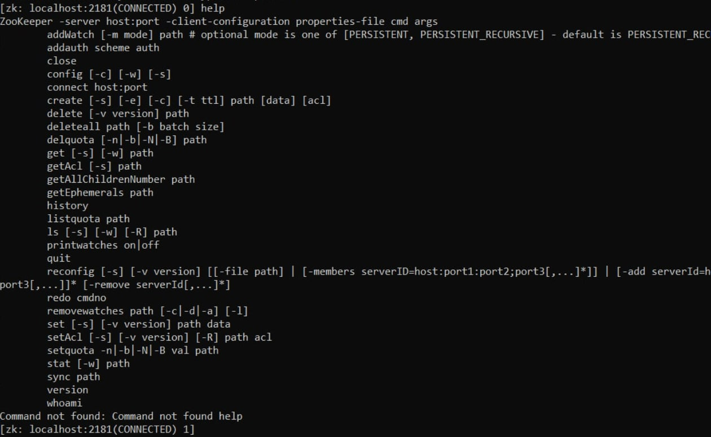

# 2) Добавление узлов znode, считывание и запись данных в znode из CLI, управление конфигурациями

Для вывода списка корневых узлов - ls / - получаем один узел
Для вывода списка дочерних узлов - ls /zookeeper:

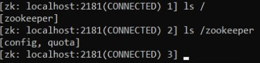

Создадим в корне узел /mynode с данными "first_version" и проверим, что в корне появился новый узел.

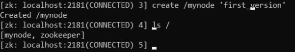

Изменим данные узла на "second_version":

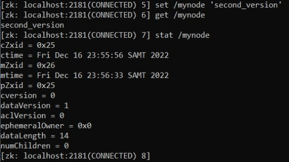

Создадим два нумерованных узла в качестве дочерних mynode:

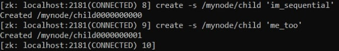

Пример. Принадлежность клиентов к группе
Внутри CLI сессии, создадим узел mygroup. Откроем две новых CLI консоли и в каждой создайте по дочернему узлу в mygroup и проверим, что grue и bleen являются членами группы mygroup:

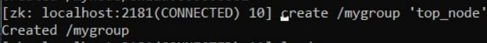
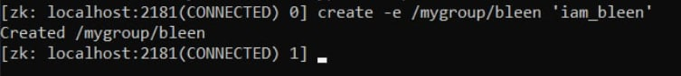
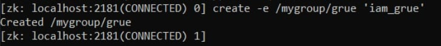
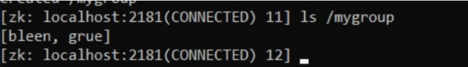

Представим теперь, что одному из клиентов нужна информация о другом клиенте (к качестве клиентов могут выступать узлы кластера). Этот сценарий эмулируется получением информации командой get.
Выберем консоль grue и обратимся к информации узла bleen.

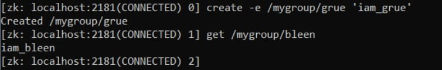

Теперь эмулируем аварийное отключение любого клиента. Нажмем сочетание клавиш Ctrl + D в одной из консолей, создавшей эфимерный узел.
Проверим, что соответствующий узел пропал из mygroup. Изменение списка дочерних узлов может произойти не сразу — от 2 до 20 tickTime, значение которого можно посмотреть в zoo.cfg.

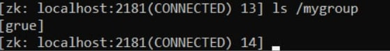

В заключении удалим узел /mygroup.

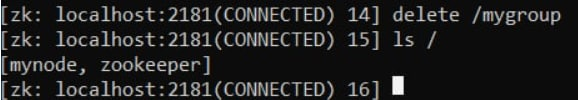